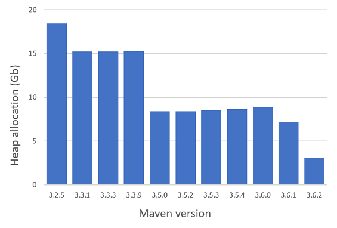
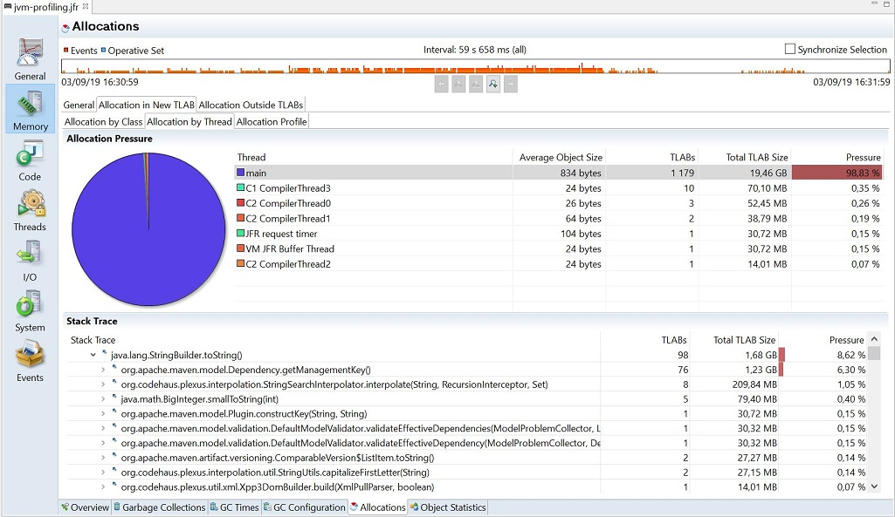

<div align="center">
<blockquote>
<p><h3>This project is a test bench to measure and investigate heap allocation of Apache Maven.</h3></p>
</blockquote>
</div>

<p align="center">
  <a href="#General-set-up">General set up</a> •
  <a href="#Benchmark-heap-allocation-of-several-Maven-releases">Benchmark heap allocation of several Maven releases</a>
</p>
<p align="center">
  <a href="#Investigate-where-heap-allocation-comes-from">Investigate where heap allocation comes from</a> •
  <a href="#Acknowledgments">Acknowledgments</a> •
  <a href="#License">License</a> 
</p>

At this moment, this project allows to benchmark and investigate the origin of heap allocation caused by *mvn validate*.

Measures have been done executing *mvn validate* on Apache Camel project. 

Feel free to use this project and contribute to it!

# General set up

This project contains two types of test.
*MvnValidateAllocationByMaven3VersionTest* can be used to investigate the origin of heap allocation level.

This general set up part describes configurations common to both test.

:point_right: For both tests, you have to give a value for the *project-under-test.path* and *maven.binaries.path* properties contained in *maven-bench.properties* file. The other properties are only used by *MvnValidateAllocationByMaven3VersionTest*.

In this project we use [QuickPerf](https://github.com/quick-perf/quickperf) to measure and investigate heap allocation level.

The needed Maven 3 distributions are downloaded by the tests. It is done in the method annotated *@Before*. See [Measure on Maven head](#Measure-on-Maven-head) part if you want to measure heap allocation of the current Maven head.
 
Heap allocation level is measured with the help of [@MeasureHeapAllocation](https://github.com/quick-perf/doc/wiki/JVM-annotations#Verify-heap-allocation) QuickPerf annotation. This annotation measures the heap allocation level of the thread running the method annotated with @Test.
Feel free to contribute to QuickPerf by adding an implementation allowing to measure the global allocation coming of all the threads! We have checked that *mvn validate* does not allocates on several threads by profiling the JVM with the help of [@ProfileJvm](https://github.com/quick-perf/doc/wiki/JVM-annotations#ProfileJvm).

Heap size can be fixed with the help of @HeapSize. As we are going to see thereafter, between Maven 3.2.5 and Maven 3.6.2, heap allocation value is the biggest with Maven 3.2.5 and the smallest with Maven 3.6.2. 
With [this computer](measures/execution-context-2019-09-01-18-48-41.txt) and with Maven 3.2.5 and an heap size between 6 Go and 9 Go, one measure of heap allocation lasts about one minute. The test length is about one minute and a half with a 5 Go heap size, probably due to more garbage collection. With Maven 3.6.2, the test length is about 15 s with an heap size between 1 Go and 9 Go.


## Clone the project on which to apply mvn validate

We you can for example use Apache Camel project to measure heap allocation of a Maven goal:
```
git clone -n https://github.com/apache/camel.git
git checkout c409ab7aabb971065fc8384a861904d2a2819be5
```
We have selected an Apache Camel commit for which ```mvn validate``` can be applied from Maven 3.2.5 to Maven 3.6.2. 
This Apache Camel version contains 841 modules.

## Measure on Maven head
To measure heap allocation on Maven head you have to before build a Maven distribution.
You can do this with the following command lines:
```
git clone https://github.com/apache/maven.git
cd maven
mvn -DdistributionTargetDir="{maven-distrib-location}/apache-maven-head" clean package
``` 
where {maven-distrib-location} has to be replaced with the url given by the *maven.binaries.path* property of *maven-bench.properties* file. 

# Benchmark heap allocation of several Maven releases

As mentioned above, *MvnValidateAllocationByMaven3VersionTest* test allows to benchmark heap allocation on several Maven 3 distributions.
Please read [General set up](#General-set-up) to get some of the set up requirements.

You have also to give a value for the following properties contained in the [maven-bench.properties](src/test/resources/maven-bench.properties) file:
* maven.version.from
* maven.version.to
* warmup.number
* measures.number-by-maven-version

The meaning of these properties is given in the [maven-bench.properties](src/test/resources/maven-bench.properties) file.

Measures can be launched with this command line: ```mvn -Dtest=MvnValidateAllocationByMaven3VersionTest test```
Before doing it, you can close your IDE, web browser or available applications to free memory.

The benchmark results are exported into a *maven-memory-allocation-{date-time}.csv* file. The execution context (processor, OS, ...) is reported in an *execution-context-{date-time}.txt* file.

For several Maven versions, the following graphic gives the average of heap allocation caused by the application of ```mvn validate``` on Apache Camel:
<p align="center">
    
</p>

For this graphics you can consult:
* [the measures](measures/maven-memory-allocation-2019-09-01-18-48-41.csv)
* [the execution context](measures/execution-context-2019-09-01-18-48-41.txt)

Measures took 1 hour and 12 minutes.

In these measures, the heap allocation decreases from ~7 Go to ~3 Go between Maven 3.6.1 to Maven 3.6.2.

# Investigate where heap allocation comes from

You can use *MvnValidateProfilingTest* to understand the origin of heap allocation.
Some of the set up requirements can be found in [General set up](#General-set-up) part.

The Maven version under test can be set with the MAVEN_3_VERSION constant:
``` java
    public static Maven3Version MAVEN_3_VERSION = Maven3Version.V_3_6_2;
```

A test method is annotated with [@ProfileJvm](https://github.com/quick-perf/doc/wiki/JVM-annotations#Profile-or-check-your-JVM) to profile the test method with Java Flight Recorder (JFR).

The JFR file location is going to be displayed in the console:
```
[QUICK PERF] JVM was profiled with Java File Recorder (JFR).
The recording file can be found here: C:\Users\JEANBI~1\AppData\Local\Temp\QuickPerf-46868616\jvm-profiling.jfr
You can open it with Java Mission Control (JMC).
```

You can open it with Java Mission Control. 

Below a JFR file for Maven 3.2.5 and open with JMC 5.5:
<p align="center">
    
</p>


By the way, you can also benefit from an automatic performance analysis with [@ExpectNoJvmIssue](https://github.com/quick-perf/doc/wiki/JVM-annotations#ExpectNoJvmIssue).
For example, the following warning is reported with Maven 3.2.5:
```
Rule: Thrown Exceptions
Severity: WARNING
Score: 97
Message: The program generated 20 482 exceptions per second during 26,722 s starting at 
03/09/19 17:08:31.
```

# Acknowledgments
Many thanks to Hervé Boutemy for his help and support to start this project.

# License
[Apache License 2.0](/LICENSE.txt)
